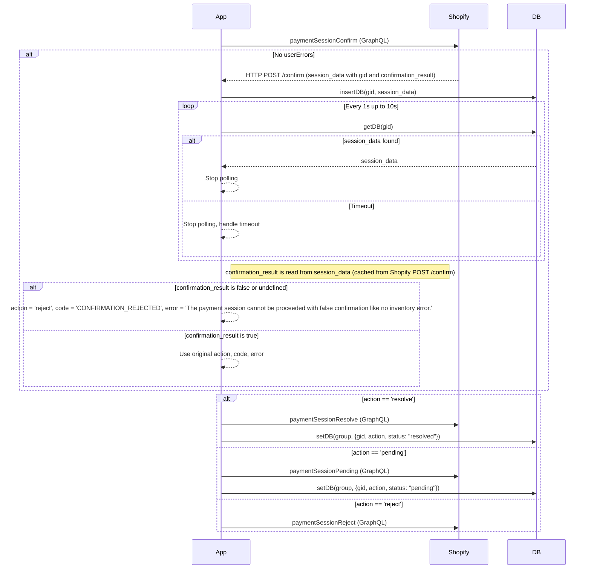

# How to implement payment session confirmation

## Overview
For offsite (redirected) payment apps to check the latest inventory for overselling protection, or get 3D secure authentication, 
Shopify provides confirm sessions process for limited partners in beta as of 2025.05. 

## Docs
- [Overview](https://shopify.dev/docs/apps/build/payments/offsite/use-the-cli?framework=remix#explore-confirm-sessions-(closed-beta))
- [GraphQL mutation](https://shopify.dev/docs/api/payments-apps/unstable/mutations/paymentSessionConfirm)
- [Payment request body](https://shopify.dev/docs/apps/build/payments/request-reference#confirm-a-payment-3-d-secure-and-inventory-confirmation)

## Code
- [How this apps does](../app.js) (search for `confirm`)

## Settings
- [Extension config file](../extensions/my-test-pay-ext/shopify.extension.toml) (check `supports_oversell_protection` and `confirmation_callback_url`)

## Notes
- Once a partner is given access to the session confirmation process, they can integrate to their all owned apps.
- Once an app is enabled session confirmation by the config, the all payment sessions require confirmation process. This means, **they can NOT toggle on / off the session confirmation per merchant.**
- `confirmation_callback_url` requires [mTLS protection](https://shopify.dev/docs/apps/build/payments/considerations#mtls-configuration) as other session URLs do.

# Demno
- Check [Wiki](../../wiki)