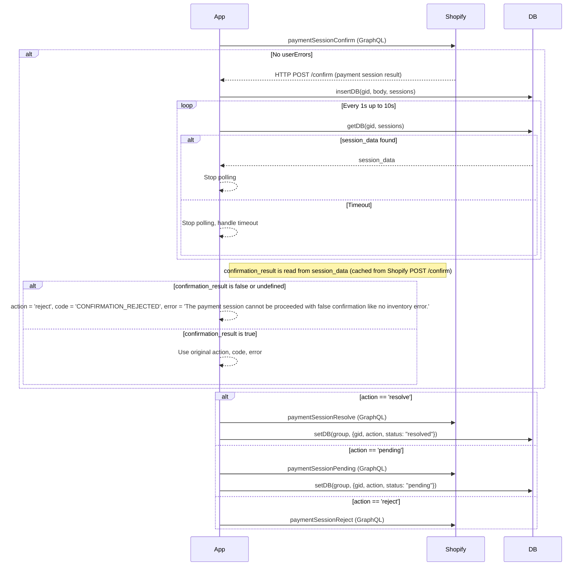

```mermaid
sequenceDiagram
    App->>Shopify: paymentSessionConfirm (GraphQL)
    alt No userErrors
        Shopify-->>App: HTTP POST /confirm (payment session result)
        App->>DB: insertDB(gid, body, sessions)
        loop Every 1s up to 10s
            App->>DB: getDB(gid, sessions)
            alt session_data found
                DB-->>App: session_data
                App-->>App: Stop polling
            else Timeout
                App-->>App: Stop polling, handle timeout
            end
        end
        Note right of App: confirmation_result is read from session_data (cached from Shopify POST /confirm)
        alt confirmation_result is false or undefined
            App-->>App: action = 'reject', code = 'CONFIRMATION_REJECTED', error = 'The payment session cannot be proceeded with false confirmation like no inventory error.'
        else confirmation_result is true
            App-->>App: Use original action, code, error
        end
    end
    alt action == 'resolve'
        App->>Shopify: paymentSessionResolve (GraphQL)
        App->>DB: setDB(group, {gid, action, status: "resolved"})
    else action == 'pending'
        App->>Shopify: paymentSessionPending (GraphQL)
        App->>DB: setDB(group, {gid, action, status: "pending"})
    else action == 'reject'
        App->>Shopify: paymentSessionReject (GraphQL)
    end
```
