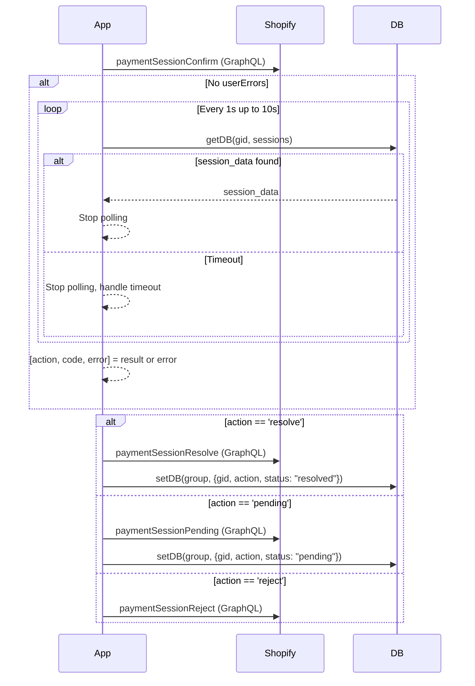

```mermaid
sequenceDiagram
    App->>Shopify: paymentSessionConfirm (GraphQL)
    alt No userErrors
        loop Every 1s up to 10s
            App->>DB: getDB(gid, sessions)
            alt session_data found
                DB-->>App: session_data
                App-->>App: Stop polling
            else Timeout
                App-->>App: Stop polling, handle timeout
            end
        end
        App-->>App: [action, code, error] = result or error
    end
    alt action == 'resolve'
        App->>Shopify: paymentSessionResolve (GraphQL)
        App->>DB: setDB(group, {gid, action, status: "resolved"})
    else action == 'pending'
        App->>Shopify: paymentSessionPending (GraphQL)
        App->>DB: setDB(group, {gid, action, status: "pending"})
    else action == 'reject'
        App->>Shopify: paymentSessionReject (GraphQL)
    end
```